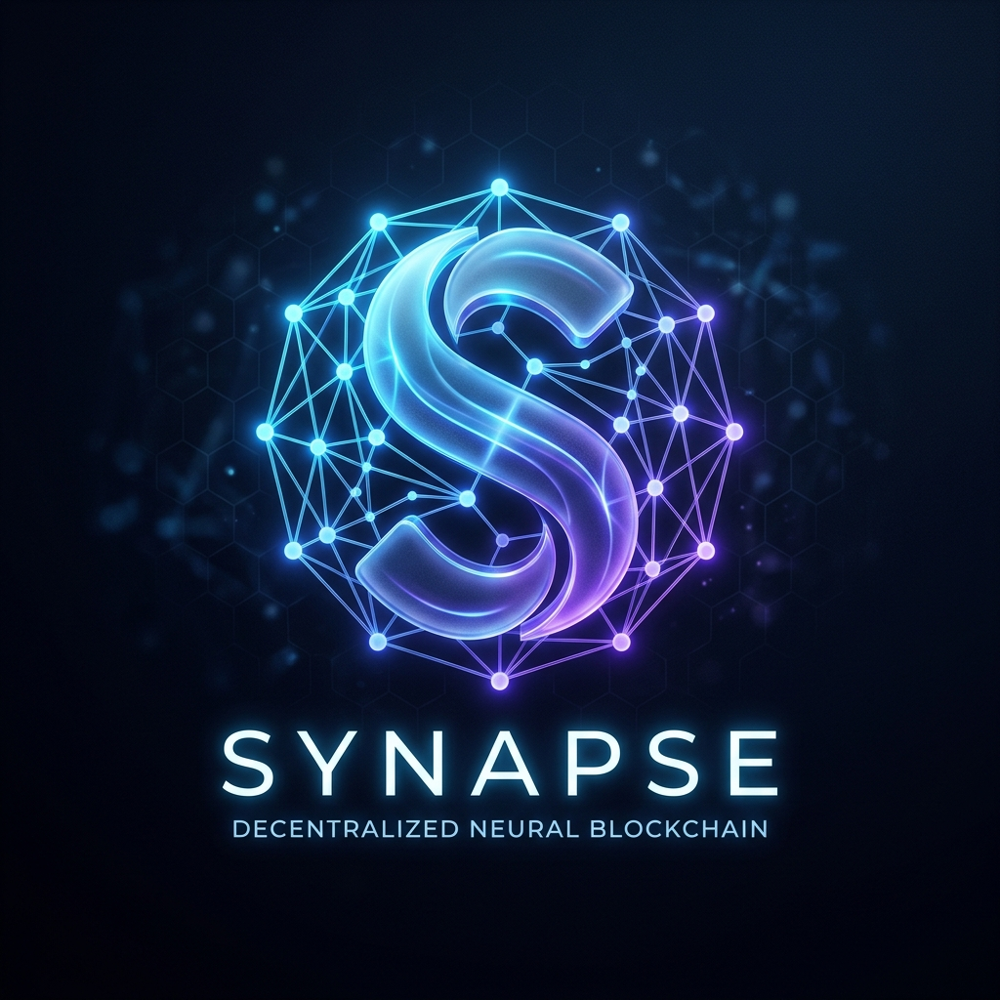

# Project Synapse



### **The Decentralized Credential Protocol**

Synapse is a next-generation platform for managing secure, verifiable, and on-chain credentials. It empowers institutions to issue cryptographically signed certificates, while allowing users to own and verify their digital identity with unprecedented transparency and security.

---

## 🚀 **Key Features**

- **Institutional Issuance**: Secure and automated certificate/credential issuance from verified institutions.
- **On-Chain Revocation**: Permanent, instant, and verifiable credential revocation in case of compromise or expiration.
- **Verification Portal**: A public gateway for employers and third parties to instantly verify credential status against the blockchain.
- **Institutional Management**: Advanced administrative controls for universities and training providers.
- **Universal Dashboard**: A unified view for students and professionals to manage their academic/professional history.
- **Sleek UI/UX**: Built with modern aesthetics, featuring dark mode, animations, and professional micro-interactions.

---

## 🛠️ **Technology Stack**

| Layer | Technologies |
| :--- | :--- |
| **Smart Contracts** | Solidity, Foundry, OpenZeppelin |
| **Blockchain** | Ethereum (L1/L2), Ethers.js |
| **Frontend** | React (Vite), Tailwind CSS, Framer Motion |
| **Backend** | Node.js (Express), PostgreSQL |
| **Tooling** | Git, npm, Foundry |

---

## 📂 **Project Structure**

```text
project-synapse/
├── assets/                 # Brand assets (logos, etc.)
├── project-synapse/        # Core workspace
│   ├── backend/            # Express.js REST API
│   ├── frontend/           # Vite/React Application
│   ├── contracts/          # Solidity Smart Contracts
│   ├── migrations/         # Deployment scripts
│   ├── lib/                # Smart contract libraries
│   └── script/             # Foundry maintenance scripts
└── README.md
```

---

## 🛠️ **Getting Started**

### **Prerequisites**

- [Node.js](https://nodejs.org/) (v18+)
- [Foundry](https://getfoundry.sh/) (for smart contract development)
- [PostgreSQL](https://www.postgresql.org/) (for backend database)

### **Installation**

1.  **Clone the Repository**:
    ```bash
    git clone https://github.com/aaryaman005/Project-Synapse.git
    cd project-synapse
    ```

2.  **Setup Backend**:
    ```bash
    cd project-synapse/backend
    npm install
    # Configure your .env (see .env.example)
    npm run start
    ```

3.  **Setup Frontend**:
    ```bash
    cd project-synapse/frontend
    npm install
    npm run dev
    ```

4.  **Setup Smart Contracts**:
    ```bash
    cd project-synapse
    forge build
    ```

---

## 📄 **License**

This project is licensed under the **ISC License**.

---

## ✨ **Contributors**

- [Aaryaman](https://github.com/aaryaman005) - Core Developer

---

*Synapse - Connecting the dots of the decentralized web.*
